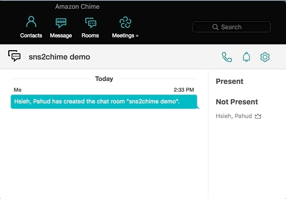
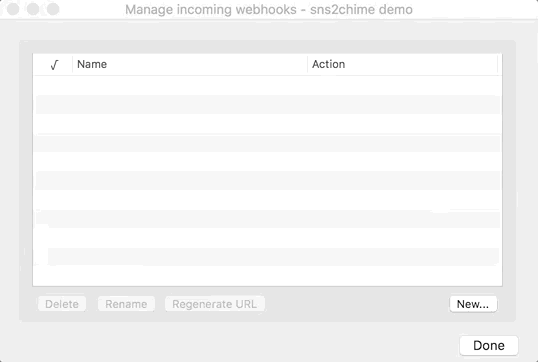

# sns2chime

sns2chime is a serverless relay service that transport the incoming SNS messages to your Chime chat room.

Made with ❤️ by Pahud Hsieh. Available on the [AWS Serverless Application Repository](https://aws.amazon.com/serverless)

## Demo

**Step 1:** create a Chime room and click ***Manage webhooks***

**Step 2:** create webhook and  ***Copy webhook URL***

**Step 3:** rename the domain from **hooks.chime.aws** to **hooks.chime.serverless.im** and leave other parts untouched.

**Step 4:** create a SNS topic, subscribe this topic as **HTTPS** endpoint and copy/paste this URL as it's endpoint value. It will immediately change its status from ***PendingConfirmation*** to confirmed.

**Step5**: create a CloudWatch Alarm and send the alarm to this SNS topic

### @All and @Present pager notification

You can add additional request arguments such as **&page_all&page_present** to the trailing of the webhook URL and sns2chime will add **@All** and **@Present** for you in the messaeg payload.

## License

Apache License 2.0 (Apache-2.0)
